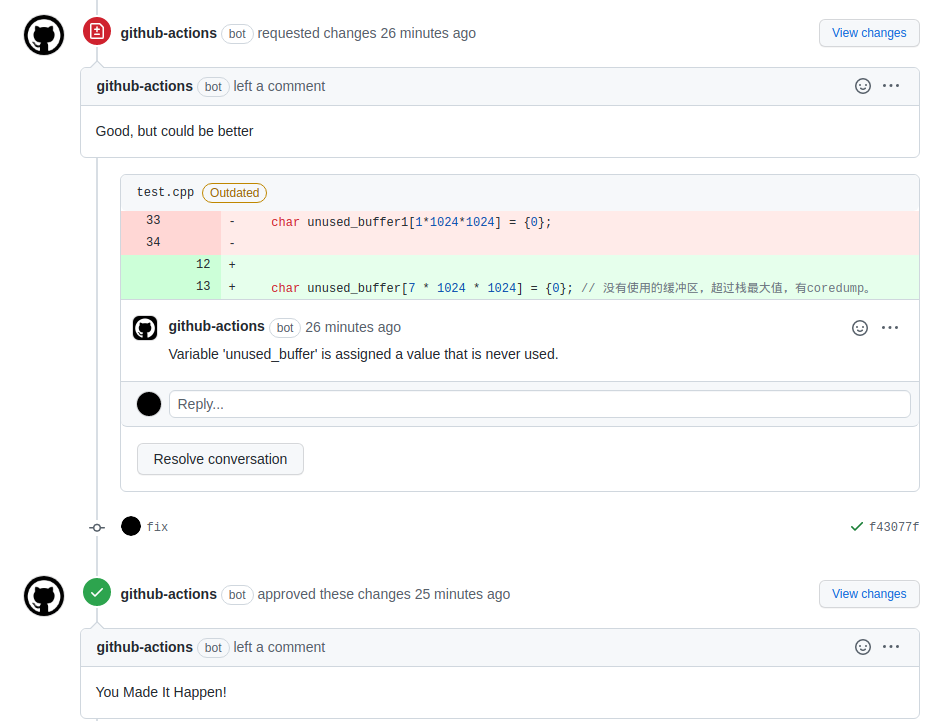

# action-cppcheck

Check pull request with cppcheck and post result to review comments.



## Inputs

```yaml
inputs:
  github_token:
    description: "action github token"
    required: false
  repository:
    description: "owner and repository name"
    required: true
  pull_request_id:
    description: "pull request id"
    required: true
  allow_approve:
    description: "allow submit approve review"
    required: true
    default: true
  enable_checks:
    description: "checks to enable"
    required: true
    default: "all"
  install_cppcheck:
    description: "install cppcheck by apt"
    required: false
    default: true
```

## Example

**use pull_request_target event**

[pull_request_target vs pull_request](
https://mirai.mamoe.net/topic/707/github-pullrequest-%E8%87%AA%E5%8A%A8%E5%AE%A1%E6%A0%B8%E5%90%88%E5%B9%B6)

```yaml
name: cppcheck
on:
  pull_request_target:
    types: [opened, synchronize]
jobs:
  cppchceck:
    name: cppcheck
    runs-on: ubuntu-latest
    steps:
      - uses: actions/checkout@v2
        with:
          ref: ${{ github.event.pull_request.head.sha }}
          persist-credentials: false
      - uses: linuxdeepin/action-cppcheck@main
        with:
          github_token: ${{ secrets.GITHUB_TOKEN }}
          repository: ${{ github.repository }}
          pull_request_id: ${{ github.event.pull_request.number }}
```

## Allow approval

See: https://github.blog/changelog/2022-01-14-github-actions-prevent-github-actions-from-approving-pull-requests/
